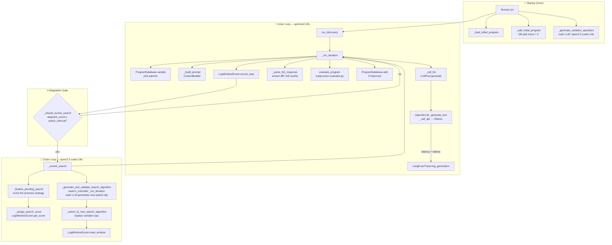

# EvoX Co-Evolution Workflow

Rendered call-graph (open in Obsidian):
![[evox_callgraph.svg]]

---

## Runtime Flow

---

## Key Data Flows

| Signal | From | To | Meaning |
|---|---|---|---|
| `score` | `evaluate_program` | `ProgramDatabase.add` | Fitness of new program |
| `stagnant_count` | `LogWindowScorer` | `_should_evolve_search` | Iterations without improvement |
| `search_algorithm` | outer LLM | `_switch_to_new_search_algorithm` | New variation operators / sampling strategy |
| `loop_type + iteration` | `set_llm_context()` | `LangFuseTracer.log_generation` | Tags LangFuse trace as inner / outer |

## File Map

| Component | File |
|---|---|
| Entry point | `skydiscover/runner.py` |
| Inner-loop controller | `skydiscover/search/default_discovery_controller.py` |
| Co-evolution controller | `skydiscover/search/evox/controller.py` |
| Stagnation scorer | `skydiscover/search/evox/utils/search_scorer.py` |
| Variation operator gen | `skydiscover/search/evox/utils/variation_operator_generator.py` |
| LLM pool | `skydiscover/llm/llm_pool.py` |
| OpenAI-compat client | `skydiscover/llm/openai.py` |
| LangFuse tracing | `skydiscover/llm/langfuse_tracer.py` |
| Program database ABC | `skydiscover/search/base_database.py` |
